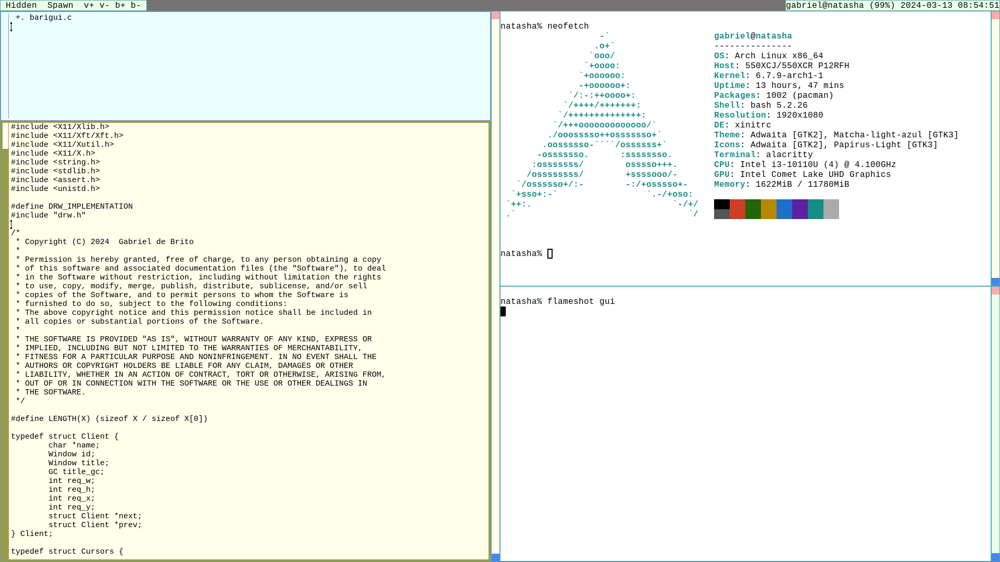
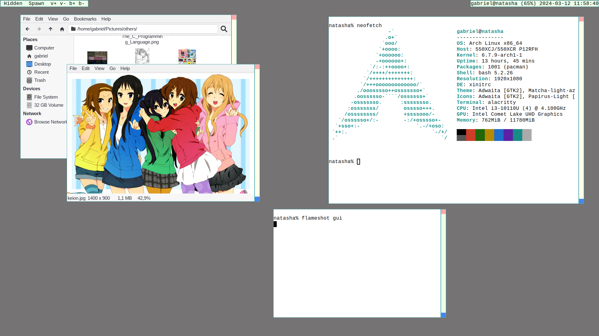

# Barigui

Mouse-oriented dynamic window manager for X11.

It manages windows in a floating way by default, but windows may be put in a
tiled "master-stack" layer, similar to [dwm](https://dwm.suckless.org/) but
reversed. Windows may be hide and are controlled via a tiny bar at their side.

## Obligatory screenshots

## Usage

The right-side bar shows the root window name, so it works as statusbar with
programs like `slstatus`.

The left side bar shows two buttons ("Hidden" and "Spawn"). They both show a
menu (with hidden windows or with programs to launch, configurable via
`config.h`. Other buttons are configurable to spawn programs too.

Window's have a title bar at their right side, with three sections:  
- The small topmost hides the window when cliked with the left button, and
  closes it when cliked with the right button.  
- The small bottom one resizes a floating window when dragged, or swaps the
  current window with the master when clicked in a tiled (clicking on the master
  swaps it with the first stacked).  
- Dragging on the main area with the left button moves the window (just focus it
  on tiled ones), and clicking with the right button toggles it's layer between
  floating and tiled.  

Floating windows are always above tiled ones.

A keybind (configurable via `config.h`) can be used to fullscreen the current
window. Clicking it again returns everything to the previous state.

## Build

Barigui depends on Xlib, Xft and Freetype2.

## Name

This is my fourth X11 window manager iteration, and the third good one. The
other two good ones are named after rivers in the [Paraná
state](https://en.wikipedia.org/wiki/Paran%C3%A1_(state)) (Iguassu and Tibaji),
so this one is named after another river.
